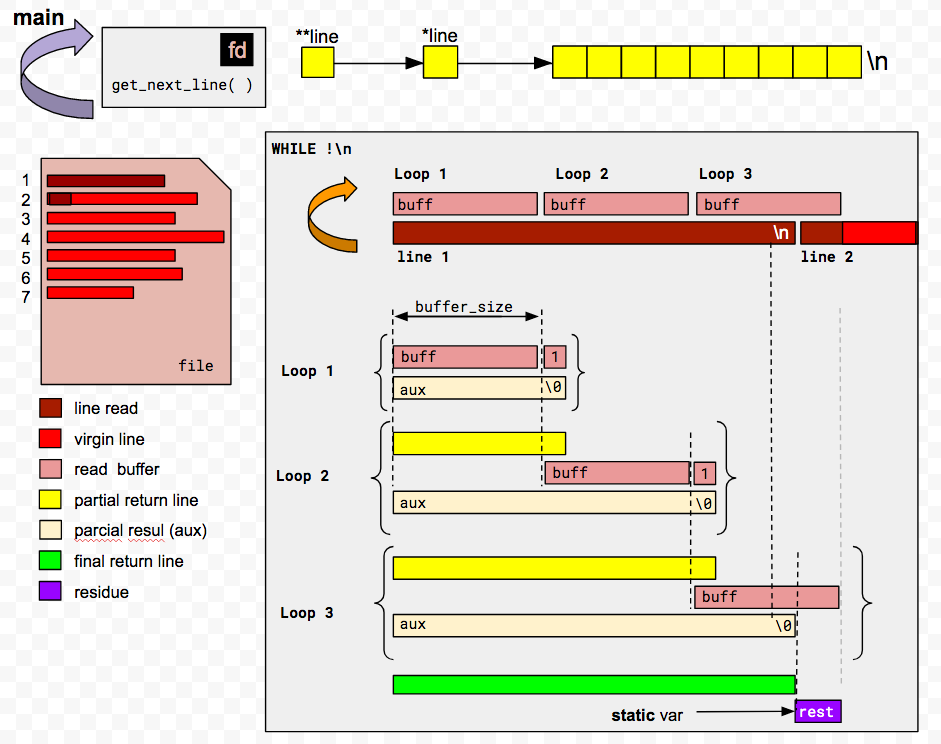
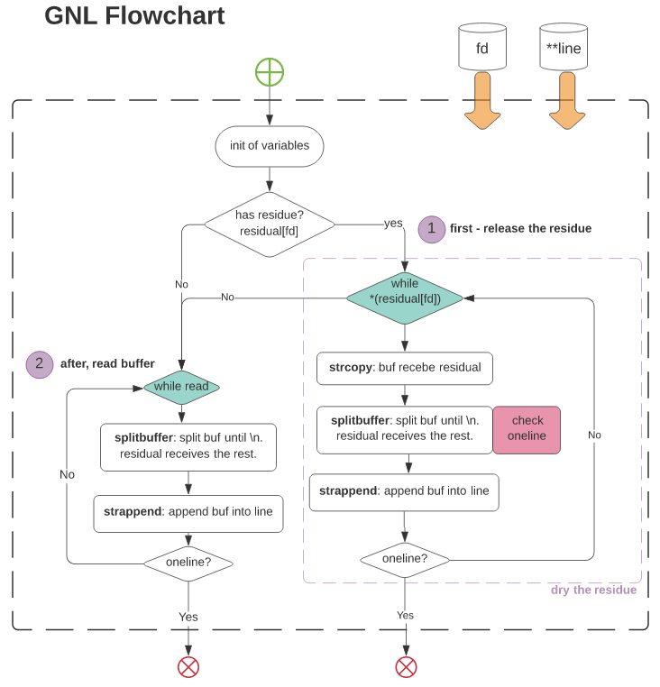
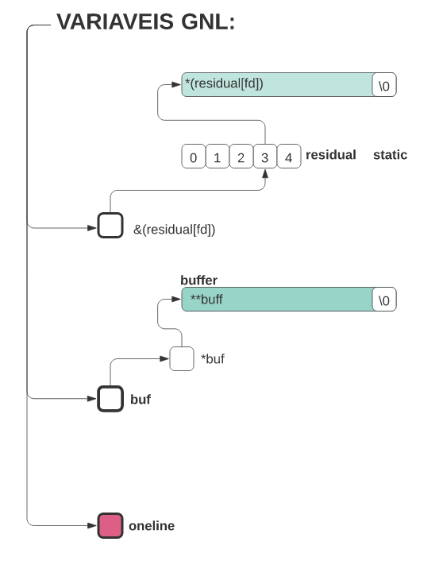
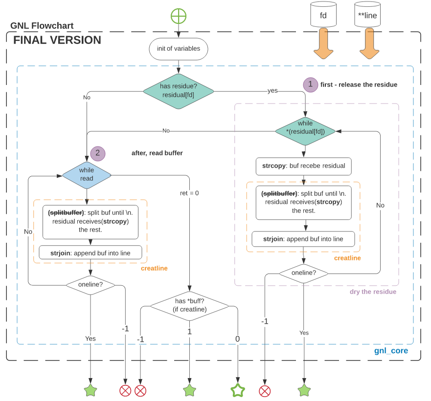

# Get_next_line42
The aim of this project is to code a function that returns a line ending with a newline, read from a file descriptor.

<h2><b>Main Idea</b></h2>

Here, a simple drawning about the main idea: copy buffer until find a '\n', keeping the residual for the next call.

<h2><b>Logic</b></h2>

Below, a get_next_line's flowchart - Before final version:

<h2><b>GNL Vars</b></h2>

The get_next_line's variables. 
Note that the bonus part (The part that treats with various files at same time), uses an string''s array, like shows the figure below, called by residual[fd]. Where each position referes to particular FD. 
On the simple get_next_line, the mandatory part, this is a simple string var.(residual).

<b>Var list:</b>

- <b>buff:</b> Read buffer (used on read function, to keep the read part)
- <b>residual:</b> residue buffer (has the same size of buff, and keep the residue of buff, after the buff is append on the line)
- <b>oneline:</b> Flag that indicates that function reach a line

<h2><b>FINAL VERSION</b></h2>

To according with moulinette, i had to split my function, because it had more than 70 lines. So, i've created a "gnl_core", that resumes the main logic of the code. Some functions, had your names changed to seem more useful to understanding.

